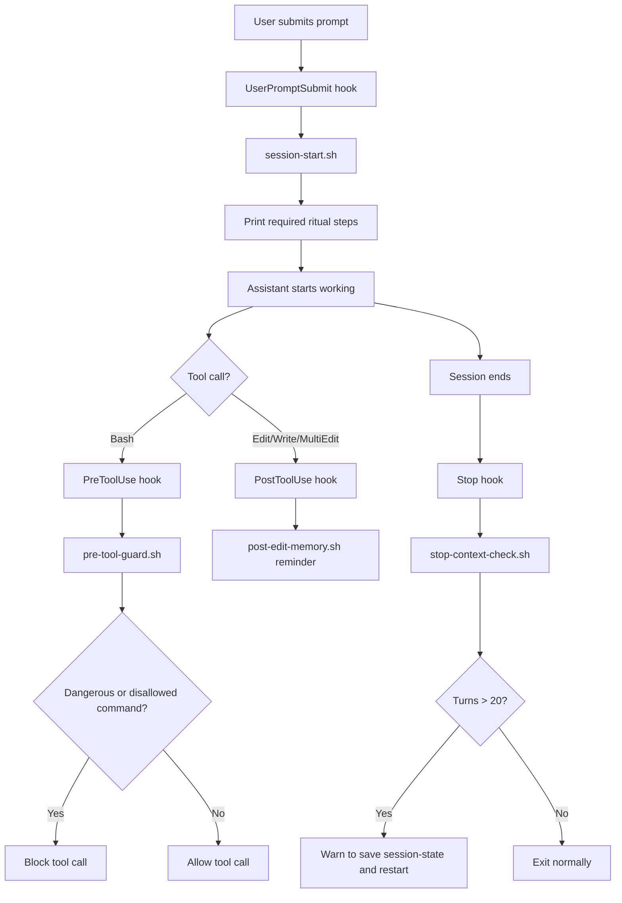

# Claude Code Guardrails Starter (Internal)

Opinionated baseline for running Claude Code with stronger engineering discipline: session rituals, tool guardrails, memory protocol, and workflow hooks.

This repository is designed for internal/team usage as a reusable configuration pack.

## Scope

This README documents:
- `CLAUDE.md`
- `rules/*.md`
- `hooks/*.sh`
- `settings.json`

Out of scope for this guide:

## Why This Exists

This setup enforces consistent behavior across sessions:
- Start every session with a memory-aware ritual.
- Prevent risky commands and low-signal code search patterns.
- Enforce TDD/verification mindset via explicit rules.
- Add reminders to persist task/session memory.
- Warn when conversation context gets too long.

## Claude Code Runtime Flow



## Project Structure (How Claude Code Works Here)

```text
.
├── CLAUDE.md
├── settings.json
├── hooks/
│   ├── session-start.sh
│   ├── pre-tool-guard.sh
│   ├── post-edit-memory.sh
│   └── stop-context-check.sh
├── rules/
│   ├── anti-hallucination.md
│   ├── architecture.md
│   ├── code-review.md
│   ├── memory-protocol.md
│   ├── plan-writing.md
│   ├── tdd.md
│   └── tool-usage.md
```

### Responsibility Map

- `CLAUDE.md`
  - Global behavior contract (identity, response style, forbidden actions).
  - Defines required session-start ritual.

- `settings.json`
  - Wires Claude Code hook events to shell scripts.
  - Entry point for runtime automation.

- `hooks/`
  - Operational enforcement at runtime.
  - `session-start.sh`: injects ritual checklist once per session.
  - `pre-tool-guard.sh`: blocks destructive Bash commands and manual grep/find patterns.
  - `post-edit-memory.sh`: reminds assistant to append task memory after file edits.
  - `stop-context-check.sh`: warns when assistant turn count is high.

- `rules/`
  - Policy library for decision quality and execution consistency.
  - Discovery vs implementation separation, TDD behavior, plan format, architecture and review constraints.

## MCP Tools Usage (Internal Standard)

Use these MCP tools as the default operating model:

| Tool | Primary use | Typical trigger |
|---|---|---|
| `serena` | Symbol-aware navigation/editing (`find_symbol`, `find_referencing_symbols`, `get_symbols_overview`) | Need exact definitions, call graph, or symbol-scoped edits |
| `mgrep` | Structural/pattern search for constants, config keys, strings, usage patterns | Need codebase-wide raw pattern search |
| `context7` | Verify external APIs/docs before writing code | Unsure library/framework API or version behavior |

### Recommended Order

1. `serena` for symbol-level discovery.
2. `mgrep` for cross-file pattern discovery.
3. `context7` before using external APIs.

## Rule Set Summary

- `rules/tool-usage.md`
  - Prefer symbol tools (`serena`) and pattern tools (`mgrep`); avoid speculative full-file reads.

- `rules/tdd.md`
  - Strict RED -> GREEN -> REFACTOR. No implementation before failing test.

- `rules/anti-hallucination.md`
  - Think checkpoints before edits and before completion claims.

- `rules/memory-protocol.md`
  - Append-only task logs, session-state capture, discovery/plan memory artifacts.

- `rules/plan-writing.md`
  - Plans must include exact files, symbols, verify commands, and expected outputs.

- `rules/architecture.md`
  - Boundaries-first design with explicit tradeoff surfacing.

- `rules/code-review.md`
  - Structured review rubric with severity levels (`BLOCK`, `SUGGEST`, `NOTE`).

## Manual Setup

1. Copy `CLAUDE.md` into your target project root.
2. Copy `rules/` into the same project root.
3. Copy `hooks/` into `$HOME/.claude/hooks/`.
4. Ensure hooks are executable:
   ```bash
   chmod +x $HOME/.claude/hooks/*.sh
   ```
5. Merge or apply this repo's `settings.json` hook block into your Claude Code settings.
6. Open Claude Code in the project and verify the session-start ritual appears on first prompt.

## Validation Checklist

- First prompt in a new session shows ritual steps from `session-start.sh`.
- `Bash` command with destructive pattern is blocked by `pre-tool-guard.sh`.
- Any edit/write action triggers post-edit memory reminder.
- Long sessions trigger context warning on stop.

## Troubleshooting

- Hooks not running:
  - Confirm `settings.json` hook mapping exists and paths are correct.
  - Verify execute permission: `chmod +x $HOME/.claude/hooks/*.sh`.

- Guard blocks expected command:
  - Review regex and conditions in `hooks/pre-tool-guard.sh`.
  - Narrow command scope instead of bypassing guardrails.

- No context warning on stop:
  - Confirm transcript path is provided by runtime and `Stop` hook is configured.

## Team Conventions

- Treat these files as infrastructure code.
- Update rules and hooks with explicit rationale in PR description.
- Keep policy changes minimal, testable, and reversible.
