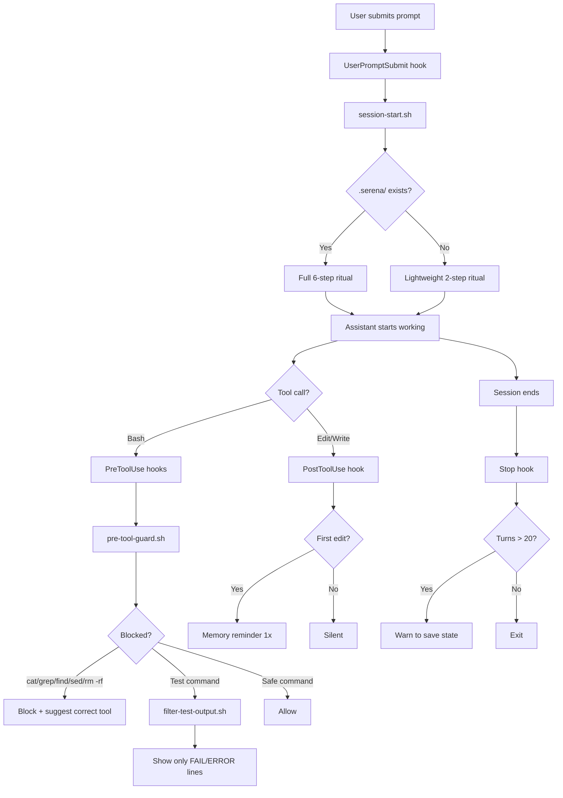

# Claude Code Setup

Opinionated configuration pack for Claude Code — enforcing engineering discipline, token efficiency, and workflow consistency.

## Quick Start

```bash
git clone <this-repo>
cd claude-setup
chmod +x install.sh
./install.sh
source ~/.zshrc
```

The installer:
- Deep-merges `settings.json` (preserves your model, custom plugins)
- Backs up existing `CLAUDE.md` and `settings.json`
- Installs hooks, rules, slash commands, and `.claudeignore`
- Sets up MCP servers (context7, mgrep, serena)
- Installs plugins (superpowers, gopls-lsp, modern-go-guidelines, reflexion, kaizen, sadd)
- Appends environment variables to `~/.zshrc`

## Runtime Flow



## Project Structure

```
.
├── CLAUDE.md              # Global behavior contract (56 lines)
├── .claudeignore          # Exclude node_modules, builds, media from context
├── settings.json          # Hooks + plugins + statusLine + model config
├── env.sh                 # Environment variables (token optimization)
├── install.sh             # Smart installer with deep-merge + plugin setup
├── commands/
│   ├── plan.md            # /plan → Opus + plan mode for architecture
│   └── ask.md             # /ask  → minimal overhead Q&A
├── hooks/
│   ├── session-start.sh       # Two-mode ritual (serena vs lightweight)
│   ├── pre-tool-guard.sh      # Block: cat/grep/find/sed/awk + destructive cmds
│   ├── filter-test-output.sh  # Filter test output to failures only
│   ├── post-edit-memory.sh    # Memory reminder (throttled: 1x per session)
│   └── stop-context-check.sh  # Context warning on long sessions
└── rules/
    ├── anti-hallucination.md  # Verification checkpoints
    ├── architecture.md        # Boundaries-first design
    ├── code-review.md         # Structured review rubric
    ├── memory-protocol.md     # Task log and session state protocol
    ├── plan-writing.md        # Plan format with exact paths and verify commands
    ├── tdd.md                 # RED → GREEN → REFACTOR discipline
    └── tool-usage.md          # Tool selection + CEK commands reference
```

## Environment Variables

```bash
ENABLE_TOOL_SEARCH=auto:5              # Defer MCP tools at 5% context
DISABLE_NON_ESSENTIAL_MODEL_CALLS=1    # Suppress background model calls
CLAUDE_AUTOCOMPACT_PCT_OVERRIDE=50     # Compact at 50% context, not 95%
MAX_THINKING_TOKENS=8000               # Reduce hidden thinking tokens
```

## Plugins (9 total)

| Plugin | Source | Purpose |
|--------|--------|---------|
| `gopls-lsp` | claude-plugins-official | Go symbol navigation via LSP |
| `modern-go-guidelines` | goland-claude-marketplace | Modern Go syntax guidelines |
| `superpowers` | claude-plugins-official | Core SDLC skills (brainstorming, TDD, debugging, etc.) |
| `reflexion` | context-engineering-kit | Self-refine + memorize insights to CLAUDE.md |
| `kaizen` | context-engineering-kit | Root cause analysis (5 Whys, fishbone, A3) |
| `sadd` | context-engineering-kit | Subagent-driven development with quality gates |
| `mgrep` | Mixedbread-Grep | Semantic/AI-powered code search |
| `context7` | claude-plugins-official | Library/framework documentation lookup |
| `cartographer` | cartographer-marketplace | Codebase mapping |

## Hooks (5 total)

| Hook | Trigger | Behavior |
|------|---------|----------|
| `session-start.sh` | UserPromptSubmit (1x) | 6-step ritual (serena) or 2-step (lightweight) |
| `pre-tool-guard.sh` | PreToolUse:Bash | Block cat/grep/find/sed/awk/rm -rf/DROP |
| `filter-test-output.sh` | PreToolUse:Bash | Filter test output to FAIL/ERROR only |
| `post-edit-memory.sh` | PostToolUse:Edit (1x) | Remind to write task-log memory |
| `stop-context-check.sh` | Stop (>20 turns) | Warn to save session state |

## Context Engineering Kit (CEK) Commands

On-demand only — zero token cost until invoked.

| Command | When |
|---------|------|
| `/reflexion:reflect` | After implementation — self-refine output |
| `/reflexion:memorize` | Persist lessons to CLAUDE.md |
| `/kaizen:why` | Bug root cause — 5 Whys analysis |
| `/kaizen:root-cause-tracing` | Trace bug through call stack |
| `/kaizen:analyse-problem` | A3 one-page problem analysis |
| `/do-in-parallel` | 2+ independent tasks — fresh subagent each |
| `/do-and-judge` | Quality-critical — implement + judge verification |
| `/do-competitively` | High-stakes — multiple solutions + judge synthesis |

## Tool Selection Order

| Need | Tool |
|------|------|
| Symbol definition/reference | `serena: find_symbol`, `find_referencing_symbols` |
| Semantic code search | `mgrep` |
| Simple regex pattern | Built-in `Grep` |
| Find files by name | Built-in `Glob` |
| Library API verification | `context7` (always before writing code) |
| Symbol-level editing | `serena: replace_symbol_body`, `insert_after_symbol` |

## Token Optimization Summary

| Strategy | Savings |
|----------|---------|
| `.claudeignore` (exclude node_modules, builds) | Prevents thousands of irrelevant files in searches |
| `CLAUDE_AUTOCOMPACT_PCT_OVERRIDE=50` | Earlier compaction, cleaner context |
| `MAX_THINKING_TOKENS=8000` | ~75% reduction in hidden thinking cost |
| `ENABLE_TOOL_SEARCH=auto:5` | Defer MCP tool defs at 5% context |
| `filter-test-output.sh` | Test suite 500+ lines → ~20 lines |
| Conditional session ritual | Skip 4 tool calls for non-coding sessions |
| Memory reminder throttle | 1x per session instead of every edit |
| Subagent model selection | Haiku for research, Sonnet for implementation |
| CEK commands (on-demand) | 0 token cost until invoked |

## Validation Checklist

- [ ] First prompt shows ritual from `session-start.sh`
- [ ] Serena project → 6-step ritual; non-serena → 2-step
- [ ] `Bash` with `cat`, `grep`, `rm -rf` blocked by `pre-tool-guard.sh`
- [ ] `go test` output filtered to failures by `filter-test-output.sh`
- [ ] First edit triggers memory reminder; subsequent edits silent
- [ ] Long sessions (>20 turns) trigger context warning
- [ ] `/plan` available as slash command
- [ ] `/ask` available as slash command
- [ ] `/reflexion:reflect` and `/kaizen:why` load on-demand

## Manual Setup

If you prefer not to use the installer:

1. Copy files to `~/.claude/`:
   ```bash
   cp CLAUDE.md ~/.claude/CLAUDE.md
   cp .claudeignore ~/.claude/.claudeignore
   cp rules/*.md ~/.claude/rules/
   cp hooks/*.sh ~/.claude/hooks/ && chmod +x ~/.claude/hooks/*.sh
   cp commands/*.md ~/.claude/commands/
   jq -s '.[0] * .[1]' ~/.claude/settings.json settings.json > /tmp/merged.json && mv /tmp/merged.json ~/.claude/settings.json
   ```

2. Source environment variables:
   ```bash
   source env.sh
   # Or append to ~/.zshrc manually
   ```

3. Install MCP servers:
   ```bash
   claude mcp add --scope user context7 -- npx -y @upstash/context7-mcp
   claude mcp add --scope user mgrep -- npx -y @mixedbread/mgrep mcp
   claude mcp add --scope user serena -- uvx --from git+https://github.com/oraios/serena serena start-mcp-server --context=claude-code --project-from-cwd
   ```

4. Install plugins (inside Claude Code):
   ```
   /plugin marketplace add obra/superpowers-marketplace
   /plugin marketplace add NeoLabHQ/context-engineering-kit
   /plugin install superpowers@superpowers-marketplace
   /plugin install reflexion@context-engineering-kit
   /plugin install kaizen@context-engineering-kit
   /plugin install sadd@context-engineering-kit
   ```
