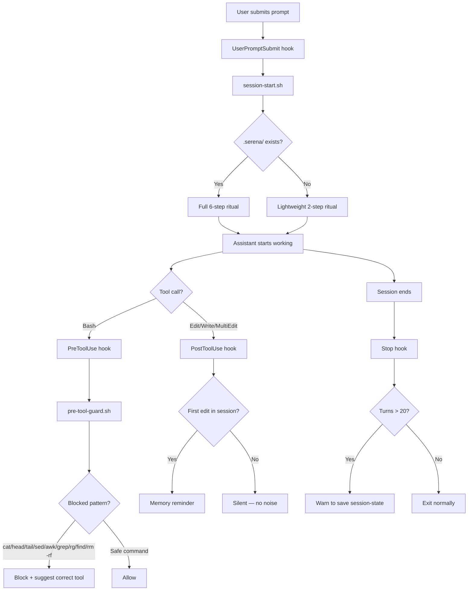

# Claude Code Guardrails Starter (Internal)

Opinionated baseline for running Claude Code with stronger engineering discipline: session rituals, tool guardrails, memory protocol, and workflow hooks.

This repository is designed for internal/team usage as a reusable configuration pack.

## Quick Start

```bash
git clone <this-repo>
cd claude-setup
chmod +x install.sh
./install.sh
```

The installer:
- Deep-merges `settings.json` into existing config (preserves your model, plugins, statusLine)
- Backs up existing `CLAUDE.md` and `settings.json` before overwriting
- Installs hooks with execute permissions
- Sets up MCP servers (context7, mgrep, serena)

## Why This Exists

This setup enforces consistent behavior across sessions:
- Start every session with a memory-aware ritual (two modes: serena vs lightweight).
- Prevent risky commands and enforce proper tool usage.
- Enforce TDD/verification mindset via explicit rules.
- Remind to persist task/session memory (once per session, not per edit).
- Warn when conversation context gets too long.

## Claude Code Runtime Flow



## Project Structure

```text
.
├── CLAUDE.md              # Global behavior contract
├── settings.json          # Complete config: hooks + plugins + statusLine + model
├── install.sh             # Smart installer with deep-merge
├── hooks/
│   ├── session-start.sh   # Two-mode ritual (serena vs lightweight)
│   ├── pre-tool-guard.sh  # Blocks: cat/head/tail/sed/awk/grep/rg/find + destructive cmds
│   ├── post-edit-memory.sh # Memory reminder (throttled: once per session)
│   └── stop-context-check.sh # Context warning on long sessions
└── rules/
    ├── anti-hallucination.md  # Verification checkpoints
    ├── architecture.md        # Boundaries-first design
    ├── code-review.md         # Structured review rubric
    ├── memory-protocol.md     # Task log and session state protocol
    ├── plan-writing.md        # Plan format with exact paths and verify commands
    ├── tdd.md                 # RED → GREEN → REFACTOR discipline
    └── tool-usage.md          # Tool selection: serena vs mgrep vs built-in Grep
```

### Responsibility Map

- `CLAUDE.md`
  - Global behavior contract (identity, response style, forbidden actions).
  - Defines two-mode session ritual and subagent discipline.
  - Trimmed to only include rules NOT already in Claude Code's system prompt.

- `settings.json`
  - Complete Go-team config: hooks, plugins (gopls-lsp, modern-go-guidelines, superpowers), statusLine, model.
  - Installer deep-merges this into existing config.

- `hooks/`
  - `session-start.sh`: Two-mode ritual — full 6-step for serena projects, lightweight 2-step otherwise.
  - `pre-tool-guard.sh`: Blocks `cat`, `head`, `tail`, `sed`, `awk`, `grep`, `rg`, `find`, `rm -rf`, `DROP TABLE/DATABASE`.
  - `post-edit-memory.sh`: Throttled memory reminder — fires once per session, not per edit.
  - `stop-context-check.sh`: Warns when assistant turn count exceeds 20.

- `rules/`
  - Policy library for decision quality and execution consistency.
  - Discovery vs implementation separation, TDD behavior, plan format, architecture and review constraints.

## MCP Tools Usage

| Tool | Purpose | When to use |
|---|---|---|
| `serena` | Symbol-aware navigation/editing | Need exact definitions, call graph, or symbol-scoped edits |
| `mgrep` | Semantic/AI-powered code search | Cross-file pattern discovery, understanding usage patterns |
| `context7` | Verify external APIs/docs | Before writing code that uses external packages |
| Built-in `Grep` | Simple regex search | Quick pattern matching when mgrep is overkill |
| Built-in `Glob` | Find files by name | Locate files by path pattern |

### Tool Selection Order

1. `serena` for symbol-level discovery.
2. `mgrep` for semantic cross-file search.
3. Built-in `Grep`/`Glob` for simple pattern/file matching.
4. `context7` before using any external API.

## Manual Setup

1. Copy `CLAUDE.md` to `~/.claude/CLAUDE.md`.
2. Copy `rules/*.md` to `~/.claude/rules/`.
3. Copy `hooks/*.sh` to `~/.claude/hooks/` and `chmod +x`.
4. Deep-merge `settings.json` into `~/.claude/settings.json`:
   ```bash
   jq -s '.[0] * .[1]' ~/.claude/settings.json settings.json > /tmp/merged.json
   mv /tmp/merged.json ~/.claude/settings.json
   ```
5. Install MCP servers:
   ```bash
   claude mcp add --scope user context7 -- npx -y @upstash/context7-mcp
   claude mcp add --scope user mgrep -- npx -y @mixedbread/mgrep mcp
   claude mcp add --scope user serena -- uvx --from git+https://github.com/oraios/serena serena start-mcp-server --context=claude-code --project-from-cwd
   ```

## Validation Checklist

- First prompt in a new session shows ritual steps from `session-start.sh`.
- Serena project gets 6-step ritual; non-serena project gets 2-step.
- `Bash` command with `cat`, `grep`, `rm -rf` is blocked by `pre-tool-guard.sh`.
- First edit triggers memory reminder; subsequent edits are silent.
- Long sessions trigger context warning on stop.

## Troubleshooting

- **Hooks not running:** Confirm `settings.json` hook mapping exists and paths are correct. Verify execute permission: `chmod +x ~/.claude/hooks/*.sh`.
- **Guard blocks expected command:** Review patterns in `hooks/pre-tool-guard.sh`. Narrow command scope instead of bypassing guardrails.
- **No context warning on stop:** Confirm transcript path is provided by runtime and `Stop` hook is configured.
- **Settings overwritten:** Restore from `~/.claude/settings.json.bak` and re-run installer.

## Team Conventions

- Treat these files as infrastructure code.
- Update rules and hooks with explicit rationale in PR description.
- Keep policy changes minimal, testable, and reversible.
