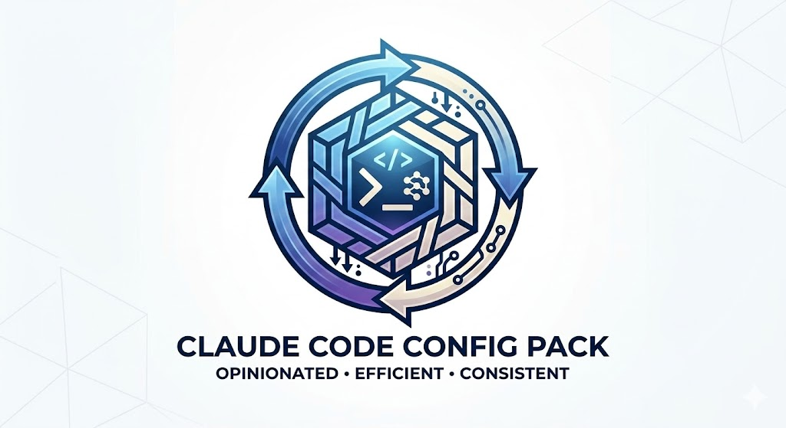

<div align="center">

# Claude Code Setup



Opinionated configuration pack for Claude Code — enforcing engineering discipline, token efficiency, and workflow consistency.

</div>

## Quick Start

```bash
git clone <this-repo>
cd claude-setup
chmod +x install.sh
./install.sh
```

The installer:
- Deep-merges `settings.json` (preserves your model, custom plugins)
- Backs up existing `CLAUDE.md` and `settings.json`
- Installs hooks, read-once hook, commands, RTK.md, and `.claudeignore`
- Installs ccusage if not found (`npm install -g ccusage`)
- Sets up MCP servers (context7, mgrep, serena)
- Installs plugins (8 total — see Plugins section)
- Env vars managed via `settings.json` (no `.zshrc` modification)

## Project Structure

```
.
├── CLAUDE.md              # Global behavior contract
├── RTK.md                 # RTK token savings reference
├── .claudeignore          # Exclude node_modules, builds, media from context
├── settings.json          # Hooks + plugins + statusLine + env vars
├── env.sh                 # Env vars reference (fallback — settings.json is primary)
├── install.sh             # Smart installer with deep-merge + plugin setup
├── commands/
│   ├── plan.md                   # /plan → plan mode
│   ├── ask.md                    # /ask  → minimal overhead Q&A
│   ├── plannotator-annotate.md   # /plannotator-annotate → annotate markdown
│   └── plannotator-review.md     # /plannotator-review  → code review UI
├── hooks/
│   ├── rtk-rewrite.sh         # PreToolUse:Bash — rewrite commands via RTK (token savings)
│   ├── session-context.sh     # UserPromptSubmit — inject project/branch/cwd context
│   ├── statusline.sh          # StatusLine — ccusage burn rate + block session % remaining
│   ├── pre-compact.sh         # PreCompact — save git status to .claude-handOFF.md
│   └── filter-test-output.sh  # PostToolUse:Bash — compress test output to failures only
└── read-once/
    └── hook.sh                # PreToolUse:Read — prevent redundant re-reads (80-95% savings)
```

## Environment Variables

Managed via `settings.json` `"env"` block (no `.zshrc` changes needed):

```bash
ENABLE_TOOL_SEARCH=auto:5              # Defer MCP tools at 5% context
DISABLE_NON_ESSENTIAL_MODEL_CALLS=1    # Suppress background model calls
CLAUDE_AUTOCOMPACT_PCT_OVERRIDE=40     # Compact at 40% context, not 95%
MAX_THINKING_TOKENS=8000               # Reduce hidden thinking tokens
```

## Plugins (8 total)

| Plugin | Source | Purpose |
|--------|--------|---------|
| `superpowers` | claude-plugins-official | Core SDLC skills (brainstorming, TDD, debugging, plans) |
| `gopls-lsp` | claude-plugins-official | Go symbol navigation via LSP |
| `mgrep` | Mixedbread-Grep | AI-powered code + web search (replaces Grep/WebSearch) |
| `context-mode` | context-mode | Context window protection via sandbox execution |
| `claude-mem` | thedotmack | Cross-session memory with timeline and smart search |
| `plannotator` | plannotator | Interactive plan annotation and code review UI |
| `ast-grep` | ast-grep-marketplace | Structural code search/refactor via AST patterns |
| `cartographer` | cartographer-marketplace | Codebase mapping → docs/CODEBASE_MAP.md |

## Hooks (6 total)

| Hook | Event | Behavior |
|------|-------|----------|
| `rtk-rewrite.sh` | PreToolUse:Bash | Auto-rewrite commands via RTK (60-90% token savings) |
| `session-context.sh` | UserPromptSubmit | Inject project, branch, cwd, go_module into context |
| `statusline.sh` | StatusLine | ccusage burn rate + block session % remaining |
| `pre-compact.sh` | PreCompact | Save git status to `.claude-handOFF.md` before compaction |
| `filter-test-output.sh` | PostToolUse:Bash | Compress test output to FAIL/ERROR lines only |
| `read-once/hook.sh` | PreToolUse:Read | Block redundant re-reads within a session (80-95% savings) |

## Slash Commands (4 total)

| Command | Purpose |
|---------|---------|
| `/plan` | Enter plan mode |
| `/ask` | Quick Q&A, minimal overhead |
| `/plannotator-annotate` | Open annotation UI for a markdown file |
| `/plannotator-review` | Open code review UI for current changes |

## Mandatory Search Rules

All search is routed through `mgrep` (enforced via CLAUDE.md):
- Web search: `mgrep --web "query"` — never built-in WebSearch
- Code search: `mgrep "query"` — never built-in Grep or Glob

## Token Optimization Summary

| Strategy | Savings |
|----------|---------|
| RTK hook (`rtk-rewrite.sh`) | 60-90% on git/test/build commands |
| read-once hook | 80-95% on repeated file reads within a session |
| `.claudeignore` (exclude node_modules, builds) | Prevents irrelevant files in searches |
| `CLAUDE_AUTOCOMPACT_PCT_OVERRIDE=40` | Earlier compaction, cleaner context |
| `MAX_THINKING_TOKENS=8000` | ~75% reduction in hidden thinking cost |
| `ENABLE_TOOL_SEARCH=auto:5` | Defer MCP tool defs at 5% context |
| `filter-test-output.sh` | Test suite 500+ lines → ~20 lines |
| `context-mode` plugin | Large output sandboxed, not streamed to context |
| Subagent model selection | Haiku for research, Sonnet for implementation |

## Prerequisites

Required:
- `claude` — Claude Code CLI (`npm install -g @anthropic-ai/claude-code`)
- `node` — Node.js
- `jq` — JSON processor (`brew install jq`)
- `git`

Recommended (automatic token savings):
- `rtk` — Rust Token Killer: https://github.com/rtk-ai/rtk#installation
- `python3` — for statusline block % calculation
- `bun` — faster JS execution: `curl -fsSL https://bun.sh/install | bash`

Optional (semantic code navigation):
- `uvx` — for Serena MCP: `curl -LsSf https://astral.sh/uv/install.sh | sh`
- `gopls` — for gopls-lsp plugin: `go install golang.org/x/tools/gopls@latest`

## Manual Setup

```bash
cp CLAUDE.md RTK.md ~/.claude/
cp .claudeignore ~/.claude/.claudeignore
cp hooks/*.sh ~/.claude/hooks/ && chmod +x ~/.claude/hooks/*.sh
cp read-once/hook.sh ~/.claude/read-once/hook.sh && chmod +x ~/.claude/read-once/hook.sh
cp commands/*.md ~/.claude/commands/
jq -s '.[0] * .[1]' ~/.claude/settings.json settings.json > /tmp/merged.json && mv /tmp/merged.json ~/.claude/settings.json
```

MCP servers:
```bash
claude mcp add --scope user context7 -- npx -y @upstash/context7-mcp
claude mcp add --scope user mgrep -- npx -y @mixedbread/mgrep mcp
# Optional: serena (requires uvx)
claude mcp add --scope user serena -- uvx --from git+https://github.com/oraios/serena serena start-mcp-server --context=claude-code --project-from-cwd
```

## Validation Checklist

- [ ] `statusline` shows burn rate + session % remaining
- [ ] Bash commands auto-rewritten via RTK (run `rtk gain` to verify savings)
- [ ] `mgrep "query"` returns semantic results (not raw grep)
- [ ] First prompt injects `[Session] project=... branch=... cwd=...`
- [ ] `go test` output compressed to failures only
- [ ] `/compact` saves git status to `.claude-handOFF.md`
- [ ] Re-reading unchanged files shows read-once advisory in logs
- [ ] `/plan`, `/ask`, `/plannotator-annotate`, `/plannotator-review` available as slash commands
